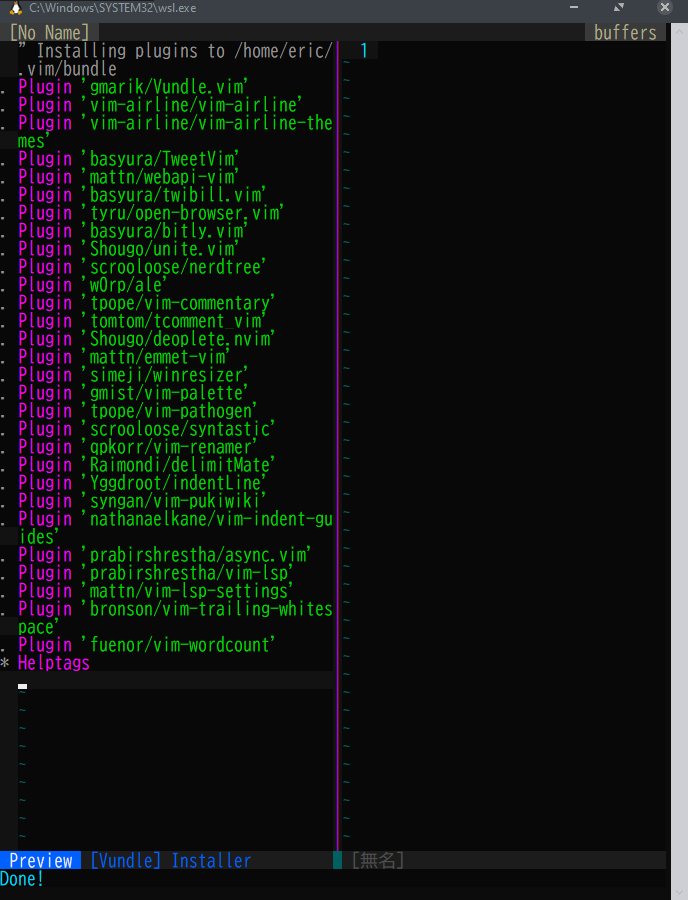

# VIM RunCommand Configration



## Bundling

- Make `.vim/` and `.vimrc`
- Install Bundle Plugin


## Installation

```sh
git clone git@github.com:Eric-lightning/.vimrc.d $HOME/
$HOME/.vimrc.d/setup.sh # Setup and Install Bundle/Colorscheme
```

## Performance

- see [TIME.log](etc/TIME.log)!
- spend about 160msec.
